# EV-Compare-App Architecture Review

Audit date: 2026-06-27  
Repository: `C:\A.P.S\College\AI ML Projects\EV-Compare-App`

## Scope

This is a critical architecture review only. No source code was rewritten. The goal is to identify architectural strengths, weaknesses, coupling, modularization opportunities, scalability limits, and prioritized improvements.

The current system is a React/Vite frontend, FastAPI backend, PostgreSQL database, Excel-driven data pipeline, FAISS-backed local RAG system, and optional external LLM/reranker providers.

## 1. Overall Architecture Diagram

```mermaid
flowchart TD
    User["User Browser"] --> FE["React + Vite Frontend"]

    FE --> Router["React Router Pages"]
    Router --> Browse["Browse / Detail / Compare / Recommend"]
    Router --> ChatUI["Chat UI"]
    Router --> MapUI["Charging Map UI"]
    Router --> AuthUI["Auth / Garage / Admin UI"]

    FE --> ApiClient["frontend/src/services/api.js"]
    MapUI --> Overpass["Overpass API"]

    ApiClient --> API["FastAPI Backend"]

    API --> AuthRoutes["Auth Routes"]
    API --> VehicleRoutes["Vehicle / Compare / Recommend Routes"]
    API --> SubsidyRoutes["Subsidy Routes"]
    API --> MapRoutes["Map Routes"]
    API --> GarageRoutes["Garage Routes"]
    API --> AdminRoutes["Admin Routes"]
    API --> ChatRoutes["Chat Routes"]

    AuthRoutes --> DB["PostgreSQL + pgvector"]
    VehicleRoutes --> DB
    SubsidyRoutes --> DB
    GarageRoutes --> DB
    AdminRoutes --> DB
    ChatRoutes --> DB

    AdminRoutes --> Importer["Excel Import Pipeline"]
    Importer --> Excel["Raw Excel Dataset"]
    Importer --> DB
    Importer --> VehicleJSON["vehicles.json"]
    Importer --> VehicleFAISS["vehicles.faiss"]
    Importer --> KnowledgeChunks["knowledge_chunks.json"]
    Importer --> KnowledgeFAISS["knowledge.faiss"]

    ChatRoutes --> RAG["EVRAGService"]
    RAG --> Parser["Query Parser"]
    RAG --> Memory["Chat Memory"]
    RAG --> Tools["DB-backed EV Tools"]
    RAG --> Retrieval["Hybrid Retrieval"]
    RAG --> ResponseBuilders["Deterministic Answer Builders"]
    RAG --> LLM["Optional LLM Rewrite"]

    Tools --> DB
    Retrieval --> VehicleJSON
    Retrieval --> VehicleFAISS
    Retrieval --> KnowledgeChunks
    Retrieval --> KnowledgeFAISS
    Retrieval --> Articles["Markdown EV Knowledge Articles"]
    LLM --> HF["Hugging Face Router"]
    LLM --> Groq["Groq-compatible API"]
    RAG --> Nvidia["Optional NVIDIA Reranker"]

    SubsidyRoutes --> RemoteSubsidy["Optional GitHub Raw Subsidy Registry"]
    MapRoutes --> StaticMapData["Static City + Station Data"]
```

## 2. Strengths of the Architecture

1. Clear full-stack separation
   - Frontend and backend are separated into `frontend/` and `backend/`.
   - API communication is centralized in `frontend/src/services/api.js`.

2. Feature-based backend routing
   - Routes are grouped by domain: vehicles, compare, recommend, subsidies, map, auth, garage, admin, chat.
   - This is easy for beginners to navigate.

3. Dataset-first application model
   - The Excel dataset is imported into structured DB rows and generated RAG artifacts.
   - The application has a real data backbone instead of hardcoded UI-only demo data.

4. Strong AI safety intent
   - The chatbot uses deterministic grounded answer builders before optional LLM rewriting.
   - The strict fallback string `Not enough data available` reduces hallucination risk.
   - Tool-backed comparison/subsidy/vehicle paths are safer than free-form generation.

5. Good local demo capability
   - Docker Compose exists.
   - Processed FAISS and JSON artifacts are already present.
   - Frontend has polished pages for major user flows.

6. Useful test coverage for AI behavior
   - RAG tests cover parsing, comparison drift, out-of-domain fallback, follow-ups, reranking, recommendations, and strict grounding.

7. Extensible conceptual knowledge layer
   - Markdown article files provide a maintainable source for EV explanations.
   - This is easier to audit than opaque LLM-only knowledge.

8. Admin data refresh path exists
   - Admin upload can trigger import and rebuild data artifacts.

## 3. Weaknesses

1. Repository hygiene is weak
   - `backend/.venv/` is present in the repo folder.
   - `frontend/dist/` generated output is present.
   - These folders increase noise, slow scans, and make source ownership unclear.

2. No migration system
   - `Base.metadata.create_all()` is used at startup.
   - This is acceptable for early development but not for controlled schema evolution.

3. Multiple overlapping AI paths
   - `ev_rag.py`, `retrieval.py`, `chat_analysis.py`, `query_parser.py`, `ev_chat_retrieval.py`, and `openai_client.py` partly overlap in purpose.
   - Future changes can accidentally update one path while another remains stale.

4. Route/service boundaries are blurred
   - `ev_tools.py` imports subsidy functions from `routes.subsidies`.
   - Services should not depend on route modules; routes should depend on services.

5. Some database models are not actually integrated
   - `ChargingStation`, `SubsidyRule`, and `KnowledgeArticle` exist but are not the primary active implementation for map, subsidy, or article knowledge.

6. Some frontend files are too large and own too many responsibilities
   - `ChatPage.jsx`, `Navbar.jsx`, and several page files combine state, API calls, business decisions, rendering, and styling.

7. Inconsistent data fetching strategy
   - React Query is installed and configured, but many pages use direct `useEffect` calls.

8. Simulated streaming
   - Chat streaming splits a fully generated answer by spaces.
   - Under load, this gives UI streaming feel but does not reduce backend generation latency.

9. Security gaps
   - Chat history lacks clear ownership enforcement.
   - JWT lives in `localStorage`.
   - No rate limiting is visible.
   - Admin upload validation is basic.

10. Local file-based RAG artifacts limit horizontal scaling
    - Multiple backend instances would need shared synchronized artifact storage or a DB/vector-store source of truth.

## 4. Components That Are Tightly Coupled

1. `routes/chat.py` and `services/ev_rag.py`
   - Chat route knows about RAG result shape and converts matches to frontend source payloads.
   - This is expected to some degree, but the route is doing more response shaping than ideal.

2. `services/ev_rag.py` and many subservices
   - `ev_rag.py` imports parser, memory, retrieval, response builders, tools, knowledge handlers, LLM generation, FAISS, and station logic.
   - It acts as an orchestrator, but it is becoming a central dependency hub.

3. `services/ev_tools.py` and `routes/subsidies.py`
   - Service imports route-level functions. This reverses the preferred dependency direction.

4. `routes/compare.py` and `services/ev_tools.py`
   - Both duplicate comparison scoring logic.
   - A scoring change must be made in two places.

5. `routes/vehicles.py`, `routes/recommend.py`, and `services/ev_tools.py`
   - Passenger car filtering logic is duplicated.

6. `frontend/src/pages/ChatPage.jsx` and chat storage/API/UI behavior
   - One page owns streaming, local session persistence, remote sessions, speech recognition, sidebar state, retries, copy behavior, and rendering.

7. `frontend/src/pages/ChargingMapPage.jsx` and external Overpass API
   - Frontend directly depends on Overpass API shape and availability.
   - Backend cannot cache, validate, or normalize live map responses.

8. Database model and import script
   - `scripts/import_excel.py` knows many details about `Vehicle` schema and generated artifacts.
   - This is normal for ETL, but it should be surrounded by validation and tests.

## 5. Components That Should Be Modularized

1. RAG orchestration
   - Split `EVRAGService.answer()` into dedicated intent handlers:
     - `SmallTalkHandler`
     - `PolicyHandler`
     - `LocationHandler`
     - `SpecHandler`
     - `ComparisonHandler`
     - `RecommendationHandler`
     - `KnowledgeHandler`
     - `FallbackHandler`

2. Vehicle filtering/scoring
   - Create a shared vehicle query/scoring service used by:
     - `routes/vehicles.py`
     - `routes/recommend.py`
     - `routes/compare.py`
     - `services/ev_tools.py`

3. Subsidy and TCO logic
   - Move subsidy formulas and policy data into `services/subsidy_service.py`.
   - Routes and tools should call that service.

4. Chat page frontend logic
   - Extract hooks:
     - `useChatStream`
     - `useChatSessions`
     - `useSpeechRecognition`
     - `useChatPersistence`

5. Map data access
   - Move Overpass calls behind backend endpoint or a frontend service adapter.
   - Normalize static and live station data to one shape.

6. Admin import workflow
   - Separate upload, validation, import, artifact build, and stats reporting.

7. Environment/provider configuration
   - Create a clearer provider selection layer for HF/Groq/OpenAI/NVIDIA.

8. Frontend UI styling
   - Move large inline styles and embedded `<style>` blocks into reusable CSS modules/classes or component-level style files.

## 6. Which Files Are Too Large

Approximate current file sizes by line count:

- `frontend/src/pages/ChatPage.jsx`: about 1139 lines.
  - Too large. It combines chat transport, local persistence, remote sessions, speech recognition, rendering, styling, and UX state.

- `backend/services/query_parser.py`: about 530 lines.
  - Large but somewhat justified. It should be split by extraction categories if it continues growing.

- `backend/services/chat_analysis.py`: about 468 lines.
  - Large and overlaps with query parsing/retrieval concepts.

- `backend/scripts/import_excel.py`: about 461 lines.
  - Large but acceptable for ETL if well-tested. Could be split into validation, transformation, DB load, and artifact build.

- `backend/services/ev_chat_response.py`: about 434 lines.
  - Large but coherent. It should be split if new answer types keep being added.

- `backend/services/ev_chat_retrieval.py`: about 431 lines.
  - Large and algorithm-heavy. It should be organized into filters, scoring, alias matching, and retrieval.

- `backend/services/ev_rag.py`: about 900+ effective responsibilities based on current content.
  - Too central. It is the main architectural pressure point.

- `frontend/src/components/Navbar.jsx`: about 352 lines.
  - Too large for a navigation component, because it includes dropdowns, mobile menu, auth actions, theme logic, and inline styling.

- `frontend/src/pages/RecommendPage.jsx`, `SubsidiesPage.jsx`, `VehicleDetailPage.jsx`, `HomePage.jsx`, `ComparePage.jsx`, `GaragePage.jsx`, `TcoPage.jsx`
  - These are medium-large. They are acceptable for a prototype, but should be decomposed before production.

## 7. Services That Violate the Single Responsibility Principle

1. `services/ev_rag.py`
   - Responsibilities:
     - Intent routing.
     - Small talk handling.
     - Out-of-domain handling.
     - Query parsing coordination.
     - Session memory application.
     - DB tool dispatch.
     - Retrieval.
     - Comparison/spec/recommendation handling.
     - Knowledge article handling.
     - LLM rewrite orchestration.
     - Grounding validation.
   - Verdict: Main SRP violation.

2. `services/query_parser.py`
   - Responsibilities:
     - Budget parsing.
     - Range parsing.
     - Segment parsing.
     - State parsing.
     - Use-case parsing.
     - User level detection.
     - Query type detection.
     - Tool requirement detection.
   - Verdict: Acceptable for now, but should be broken into parser modules or rule groups.

3. `services/ev_chat_retrieval.py`
   - Responsibilities:
     - Alias matching.
     - Vehicle-type filtering.
     - Fast-charging detection.
     - Candidate scoring.
     - BM25 scoring.
     - Cross-encoder-style reranking.
     - Hybrid retrieval.
   - Verdict: Too many algorithm families in one file.

4. `routes/chat.py`
   - Responsibilities:
     - Auth extraction.
     - Session ownership.
     - Session creation.
     - Message persistence.
     - RAG calling.
     - Source payload shaping.
     - SSE response formatting.
     - Feedback and session CRUD.
   - Verdict: Should delegate more to a chat application service.

5. `scripts/import_excel.py`
   - Responsibilities:
     - Column cleaning.
     - Value parsing.
     - Category normalization.
     - DB schema patching.
     - DB import.
     - RAG artifact generation.
     - Import state tracking.
   - Verdict: Needs separation for long-term maintainability.

6. `frontend/src/pages/ChatPage.jsx`
   - Responsibilities:
     - Chat transport.
     - Streaming state.
     - UI state.
     - Speech recognition.
     - Local storage.
     - Remote sessions.
     - Sidebar behavior.
     - Message rendering orchestration.
   - Verdict: Strong frontend SRP violation.

## 8. Where Design Patterns Are Used

1. Repository/session dependency pattern
   - `get_db` injects database sessions through FastAPI dependencies.

2. Router/controller pattern
   - FastAPI route modules act like controllers for each feature area.

3. Service layer pattern
   - AI/retrieval/import logic is mostly kept under `backend/services`.

4. DTO/schema pattern
   - Pydantic schemas are used for API request/response validation.

5. Adapter-like API client
   - `frontend/src/services/api.js` wraps backend endpoints behind frontend functions.

6. Store pattern
   - Zustand stores manage auth and comparison state.

7. Strategy-like scoring
   - Recommendation priority weights change based on user priority.
   - Retrieval scoring uses multiple scoring functions.

8. Fallback pattern
   - RAG uses deterministic fallback answers when LLM generation fails or is unsafe.
   - Chat uses in-memory fallback when DB persistence fails.

9. Facade pattern, partially
   - `EVRAGService.answer()` acts as a facade over parsing, retrieval, tools, knowledge, and LLM rewrite.

10. Lazy loading pattern
    - Frontend pages are lazy-loaded in `App.jsx`.

## 9. Where Design Patterns Should Be Used

1. Strategy pattern for chat intent handling
   - Each intent should have a handler implementing a common interface.
   - This would reduce the large conditional chain in `EVRAGService.answer()`.

2. Repository pattern for database access
   - Vehicle, chat session, garage, and subsidy queries should be isolated from routes.
   - This would make tests and future DB changes easier.

3. Service layer for subsidy/TCO
   - Move formulas out of route modules.
   - Tools and routes should reuse the same service.

4. Factory pattern for LLM providers
   - A provider factory could select HF, Groq, OpenAI, or local fallback cleanly.

5. Adapter pattern for external APIs
   - Overpass, Hugging Face, Groq, NVIDIA, and GitHub subsidy registry should be wrapped behind adapters.
   - This makes failures, retries, validation, and tests cleaner.

6. Command/job pattern for dataset import
   - Dataset upload should enqueue or execute a well-defined import job with stages.

7. Unit of Work pattern for import transactions
   - Excel import should either complete cleanly or roll back cleanly.

8. Selector/hooks pattern in frontend
   - React Query hooks should standardize loading/error/refetch behavior.

9. Presenter/ViewModel pattern for complex pages
   - Chat, compare, and recommendation pages would benefit from separate data-preparation logic.

10. Policy object pattern
    - Subsidy rules, recommendation weights, and strict no-data behavior should be explicit policy objects/configs.

## 10. Scalability Score

Score: 5.5 / 10

Reasoning:

- Good enough for local demo and small usage.
- PostgreSQL and FastAPI can scale moderately.
- The main blockers are local FAISS artifacts, no caching/rate limiting, large synchronous AI flow, frontend direct external calls, and no job queue for imports.

## 11. Maintainability Score

Score: 5 / 10

Reasoning:

- Folder separation is understandable.
- Tests help protect RAG behavior.
- But large files, duplicated logic, stale docs, overlapping services, and generated artifacts in the repo reduce maintainability.

## 12. Security Score

Score: 4.5 / 10

Reasoning:

- JWT auth and admin checks exist.
- Password hashing exists.
- But token storage, chat history ownership, upload validation, lack of rate limiting, local `.env` risk, and no production hardening keep the score below average.

## 13. AI Architecture Score

Score: 7 / 10

Reasoning:

- Strong safety-first design: deterministic drafts, strict no-data string, grounding validation, dataset-backed answers, tool-backed exact data.
- Good test coverage for high-risk AI behavior.
- Weaknesses: too many overlapping modules, provider configuration confusion, local artifact scaling, and central `ev_rag.py` complexity.

## 14. Backend Score

Score: 6 / 10

Reasoning:

- FastAPI routing is clear and feature-oriented.
- ETL, auth, admin, chat, and core user flows exist.
- Problems: no migrations, some route/service coupling, duplicated business logic, weak upload hardening, and mixed active/stale modules.

## 15. Frontend Score

Score: 6 / 10

Reasoning:

- UI is feature-rich and covers major flows.
- Routing and API wrapper are straightforward.
- Problems: oversized pages, inconsistent data fetching, inline styling, direct Overpass dependency, and complex chat state in one component.

## 16. Database Design Score

Score: 5 / 10

Reasoning:

- Core entities exist and are understandable.
- PostgreSQL is a good choice.
- Weaknesses: no migrations, comma-separated `vehicle_ids`, unused tables, unclear relationship enforcement, and limited indexing strategy.

## 17. What Would Break First Under 10,000 Users

1. Chat endpoint latency and provider limits
   - Chat is CPU/network-heavy.
   - Optional LLM calls, retrieval, and DB writes would become the first bottleneck.

2. Database connection pressure
   - Without explicit pool tuning, rate limits, and query optimization, many concurrent users would stress DB connections.

3. No rate limiting
   - Auth, chat, and admin-like endpoints could be spammed.

4. Chat session/message table growth
   - Chat history can grow quickly.
   - No retention, pagination depth strategy, or archive policy is visible.

5. Frontend live map Overpass usage
   - Many browser clients directly calling Overpass may hit external API limits or inconsistent performance.

6. Local artifact loading and memory
   - FAISS artifacts are local and probably fine at current dataset size, but deployments with multiple workers need careful warmup.

7. Garage N+1 requests
   - Garage page fetches saved IDs and then fetches vehicle details separately.

## 18. What Would Break First Under 100,000 Users

1. Architecture around chat/RAG
   - Synchronous request-response RAG with optional external LLM calls would not scale predictably.
   - Provider quotas, request timeouts, and cost would dominate.

2. Single database as all-purpose store without scaling plan
   - Chat messages, users, garage, vehicles, and feedback would all compete for the same DB.
   - Read replicas, partitioning, or separate storage strategies may be needed.

3. File-based local FAISS artifacts
   - Multi-instance deployments need shared artifact versioning.
   - Without it, instances may serve different RAG data.

4. Admin import process
   - Upload/import should not run inline on a web request at large scale.
   - It should become a background job with status tracking.

5. Lack of observability
   - Debugging slow chat, failed external providers, bad retrieval, and DB pressure would be difficult.

6. Security controls
   - Rate limiting, abuse detection, token hardening, and audit logs become mandatory.

7. Frontend bundle/page complexity
   - Large page components become harder to optimize and test.

8. Policy and live data freshness
   - Users at scale will expose stale subsidy/price/charging assumptions quickly.

## 19. Prioritized Improvements

### Priority 1: Stabilize Source Control and Runtime Hygiene

- Remove `backend/.venv/` from version control.
- Remove `frontend/dist/` from normal source commits unless intentionally publishing static artifacts.
- Confirm `.env`, `.venv`, `node_modules`, build outputs, caches, and logs are ignored.
- Keep only source, configuration templates, tests, docs, and intentional data artifacts.

### Priority 2: Fix Security-Critical Gaps

- Enforce ownership on `GET /api/chat/history/{session_id}`.
- Add rate limiting to auth and chat.
- Harden admin upload with file size, content validation, and schema validation.
- Enforce strong JWT secret outside development.
- Consider secure cookie auth for production.

### Priority 3: Add Database Migrations

- Introduce Alembic.
- Stop relying on `Base.metadata.create_all()` as the production schema strategy.
- Create explicit migrations for current models.

### Priority 4: Extract Shared Domain Services

- Create a vehicle query/filter/scoring service.
- Create a subsidy/TCO service.
- Make routes and AI tools call these services.
- Remove duplicated passenger-car filtering and comparison formulas.

### Priority 5: Modularize RAG

- Split `EVRAGService.answer()` into intent handlers.
- Keep the central service as orchestration only.
- Define clear interfaces for parser, retriever, tool runner, answer builder, and LLM rewriter.

### Priority 6: Clean AI Provider Architecture

- Create provider adapters for Hugging Face, Groq, OpenAI, and NVIDIA.
- Make provider selection explicit.
- Rename confusing settings so model names match provider usage.
- Add provider failure metrics.

### Priority 7: Refactor Frontend Complexity

- Split `ChatPage.jsx` into hooks and smaller components.
- Split `Navbar.jsx` into desktop nav, mobile nav, user menu, and theme toggle.
- Move repeated API state to React Query hooks.
- Reduce inline styling and embedded style blocks.

### Priority 8: Normalize Garage and Data Relationships

- Replace comma-separated `vehicle_ids` with a normalized saved-items schema.
- Add batch vehicle lookup endpoint.
- Add DB indexes for common vehicle filters.

### Priority 9: Move External Live Data Behind Backend

- Proxy/cache Overpass charging station calls through backend.
- Validate and normalize external station data.
- Add graceful fallback and cache TTL.

### Priority 10: Add Production Observability and Load Readiness

- Add structured logs.
- Add request timing.
- Add RAG/provider timing.
- Add readiness endpoint for DB, RAG artifacts, and providers.
- Add CI pipeline with backend tests, frontend lint, and frontend build.

## Final Architecture Verdict

The architecture is strong for a polished academic/prototype application and has unusually good intent around grounded AI behavior. The biggest architectural win is the dataset-first RAG design with deterministic fallbacks. The biggest architectural risk is that the system has grown organically: AI logic, route logic, import logic, and frontend page logic now contain several oversized files and duplicated rules.

Before adding new product features, the best architectural move is to reduce coupling and protect the foundation: migrations, security fixes, shared domain services, RAG modularization, and frontend decomposition.
